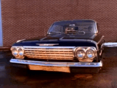

# 🎤 criss-cross


[](https://www.npmjs.com/package/criss-cross)
[](https://travis-ci.org/thierrymichel/criss-cross)
[](https://coveralls.io/github/thierrymichel/criss-cross?branch=master)

A simple and fast API to manage viewport and  DOM elements intersections as you scroll.<br>
Inspired by [scrollmonitor](https://www.npmjs.com/package/scrollmonitor) from [@stutrek](https://github.com/stutrek) and [Kriss Kross](https://www.youtube.com/watch?v=010KyIQjkTk)



> It uses [Intersection Observer API](https://developer.mozilla.org/en-US/docs/Web/API/Intersection_Observer_API), so make sure to add a [polyfill](https://github.com/WICG/IntersectionObserver/tree/gh-pages/polyfill).

## Install

```sh
npm install criss-cross --save-dev
```

## Usage

```js
import crissCross from 'criss-cross';

const $el = document.querySelector('.el');
const watcher = crissCross.create($el);

watcher.fullyEnterViewport(item => {
  item.$el.classList.add('is-animated');
});
```

```html
<script src="https://unpkg.com/criss-cross"></script>
<script>
const $el = document.querySelector('.el');
const watcher = crissCross.create($el);

watcher.lock();
watcher.on('exitViewport', item => {
  if (item.isBeforeViewport) {
    item.$el.classList.add('is-sticky');
  }
});
</script>
```

### Examples

Coming soon…

---

## API

### create(target, [options])

Returns a `watchItem` (see below)

#### target

Type: `HTMLElement` `string`

The DOM element you are "listening to".<br>
If a string is used, it should be a "documentQuerySelectorable" reference.

#### options

Type: `Object`

##### offset

Type: `Number` `Object`<br>
Default: `0`

Refers to [rootMargin](https://developer.mozilla.org/en-US/docs/Web/API/IntersectionObserver/rootMargin) property.<br>
A number value sets equal top/bottom margins, in pixels.<br>
Positive margins are added to the viewport bounding box, negative are removed.

###### top

Type: `Number`<br>
Default: `0`

###### bottom

Type: `Number`<br>
Default: `0`

> for now, only the Y axis is supported…

##### root

Type: `null` `HTMLElement`<br>
Default: `null`

Refers to [root](https://developer.mozilla.org/en-US/docs/Web/API/IntersectionObserver/root) property.<br>
If the `root` is `null`, then the bounds of the actual document viewport are used.
Other values (HTMLElement) should be parent of `target`.

### destroy()

Kills everything…

### update(watchItem, [options, force])

#### target

Type: `Item`

The watchItem you want to update the observer.

#### options

Type: `Object`

Same as `create()` options parameter…

#### force

Type: `Boolean`
Default: `false`

Force `was…` properties to be resetted to `undefined`

---

## watchItem

Returned by `crissCross.create()`.

### Methods

- `init`
- `destroy`
- `pause`
- `resume`
- `lock`<sup>*</sup>
- `unlock`<sup>*</sup>

> (*) if a watchItem had to be "fixed" (like a sticky header or whatever), we need to "lock" its initial position.<br>
> `lock()` creates a "ghost" element to keep control of the movements.

### Events

> Event callbacks receive a `watchItem` as parameter.

"Aliases":

- `enterViewport`
- `fullyEnterViewport`
- `exitViewport`
- `fullyExitViewport`

"Binders":

- `on`
- `off`
- `one`

### Properties

- `isInViewport`
- `isFullyInViewport`
- `isBeforeViewport`
- `isAfterViewport`
- `wasInViewport`
- `wasFullyInViewport`
- `wasBeforeViewport`
- `wasAfterViewport`

### Extra

- `$el`: watched element
- `observer`: IntersectionObserver instance
- `manager`: CrissCross instance

---

## License

[UNLICENSE](UNLICENSE)
